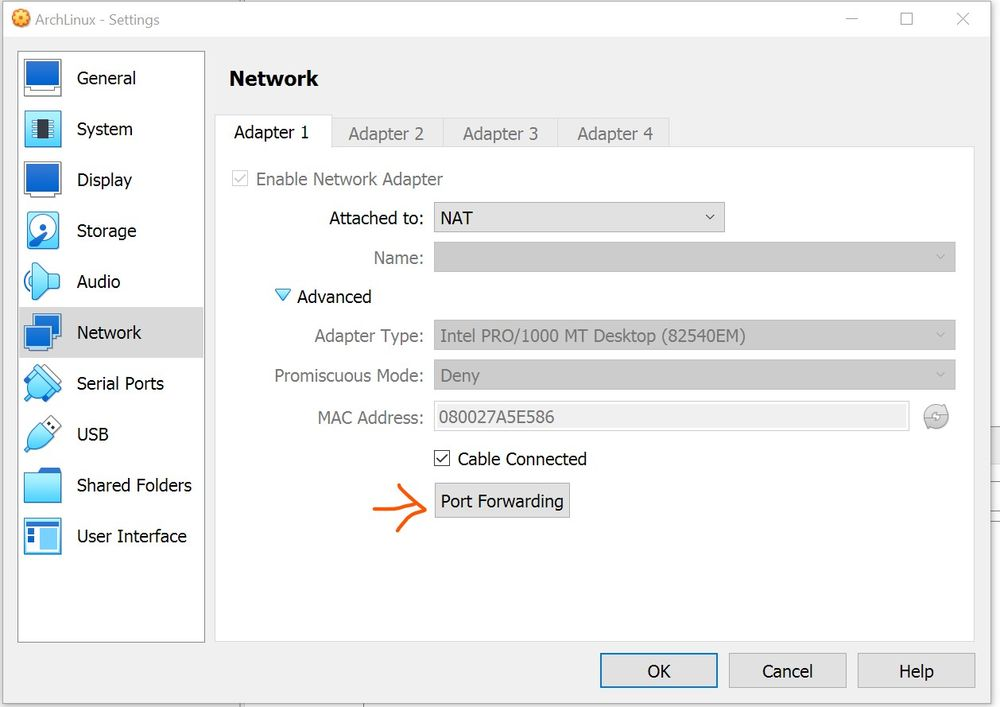
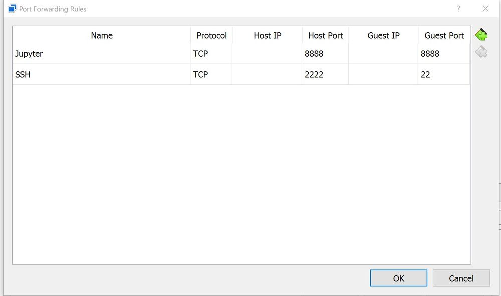

# Arch Linux

Follow latest arch linux install guide per wiki.  Below are notes covering areas that I sometimes get stuck on.

 

## Verifying signature of download on Windows
- Download the simple (non-GUI) Windows installer from here and install if not already done and install.  https://gnupg.org/download/index.html

 - 3 Items are required:
    - the iso file (obtained via magnet link or torrent)
    - the iso signature file (link from Arch download page)
    - the public key of the use that signed the iso. This can however be auto-retrieved using gpg command below. 

 - Open cmd and run below command (as per Arch Wiki install instructions Apr 2023)  
  `gpg --keyserver-options auto-key-retrieve --verify archlinux-version-<blah>.iso.sig`  
  Note that it is the signature file name included as parameter above, not the iso file name.  Iso needs to have same name though without .sig extension

 

## Networking

Internet access is configured when booting from the iso install disk (I have always been able to ping external www.archlinux.org when booted from the install image).  Below is what I have used to get internet working in the live system
 - these steps need to be completed during the install phase when booted from the iso image (when a network connection exists) once "chroot-ed" into the new system
 - install dhcpcd
 - List interfaces with `ls /sys/class/net` or  `ip link`
- Note that lo is the virtual loopback interface and not used in making network connections.
- Enable the daemon with  dhcpcd@interface.service for example systemctl enable dhcpcd@enp0s3.service

 

## SSH
 - See Arch Wiki for detail instructions.
 - Recommended to change from 22 to a random higher one.  See here for guide of unused port numbers: https://en.wikipedia.org/wiki/List_of_TCP_and_UDP_port_numbers
 - Disable passwords and force use of SSH keys (see Arch Wiki for details)
 - If running in VirtualBox -> Port forwarding needs to be enabled in Virtualbox GUI in order to SSH into virtualbox under Machine Settings / Network / Advanced / Port Forwarding.  May need to restart virtual machine after changing these settings.

 

## Jupyter lab remote access over virtualbox
 - Port forwarding needs to be enabled enabled in VirtualBox GUI Host port  = 8888, Guest Port = 8888  (It may be good to use a non-standard port though to avoid muddling with a Jupyter notebook on host using a default port.  See here for guide for unused port numbers: https://en.wikipedia.org/wiki/List_of_TCP_and_UDP_port_numbers)
 - Will have to run 2 git bash terminals in Windows unless some of below steps are automated in the guest
 - SSH into guest and run following to launch the jupyter lab server:  
 `jupyter lab --no-browser --port=8888`
 - On host (in a new shell) run:   
 `ssh -p <host ssh port> -L <host Jupyter Port>:localhost:<guest jupyter port> <remote user>@<remote host ip>`
  - For example if ssh is running on host port 2222 and port forwarding for Jupyter host and guest is 8888 run  
  `ssh -p 2222 -L 8888:localhost:8888 <user>@<remote ip address>`
 - open browser on host with url = http://localhost:8888/lab  (on first run a token will be requested which can be copied from output when jupyter lab --no-browser --port=8888 is run)  

 

## Virtualbox specific
 - Note some application level virtualbox items included in notes above.
 - Refer Arch wiki for full details on below
 - Ensure virtualbox guest is installed on guest and that latest version is installed on host (problems can arrive if versions do not match - be aware of this when performing host systems upgrades)
  - Enable daemon  
  `vboxservice.service`
  - Below seems to work for me to enable shared folders (some other methods give me permission issues)
      - Ensure guest utils are installed
      - Ensure the vboxservice.service daemon is enabled as above
      - On the Virtualbox gui add a shared folder (Machine Folder, Make Permanent - do not auto-mount or provide a mount point)
       - Do not mount directly to user home drive, as this will then result in other files under home not being visible, rather mount to a subdirectory of home
       - Mount at boot can then be handled by fstab entry as per Arch Wiki instructions  
       `sharedFolderName  /path/to/mntPtOnGuestMachine  vboxsf  uid=user,gid=group,rw,dmode=700,fmode=600,noauto,x-systemd.automount`
 - If using a GUI ensure that Virtualbox settings (on host) is set to max video memory otherwise full screen may not show correct resolution
 - Safer to not enable 3d acceleration in the Virtualbox settings (unticked by default)
 - Current setup has scaling in the virtualbox GUI (on the host) set at 100% and have scaling adjusted on the guest as below
 - Follow instructions for High Dots Per Inch display per Arch Wiki: https://wiki.archlinux.org/title/HiDPI
    - In particular see font section for xfce if using as this makes the font look good without further messing around with rendering etc.

> 
 

## Example virtualbox networking summary
Change ssh guest port 22 and Jupyter ports to a different number if a non-default port is set as recommended above

 

## Samba and sharing files on Windows

 - In Windows 10 files can be shared via samba by right clicking folder, select sharing and then advanced sharing to add users and permissions (seems to default to everyone - be sure to remove this!)
 
 - In order to access a folder shared from a Windows pc
     - Install cifs-utils
     - Need to specify uid and gid when mounting for example which will generally be the same as the username for example
       `sudo mount -t cifs //server_name_or_ip/share_name /mountpoint -o username=john,uid=my_username,gid=my_groupname
     - See arch wiki for furhter mount options and instructions
 
 - Follow arch wiki samba client instructions for further guidance
 
 - Store credentials in a protected credentials file as per Arch Wiki https://wiki.archlinux.org/title/samba#Storing_share_passwords and add reference to this file in fstab for auto mounting with something like below:
 `//SERVER/sharename /mnt/mountpoint cifs uid=my_username,gid=my_groupname,_netdev,nofail,credentials=/etc/samba/credentials/share  0 0
 
 - I found mounting network share as a systemd unit worked well  (mounting via fstab was more fiddly and never worked well for me as network was not available)
    - note that I first had to  enable systemd-networkd-wait-online.service as specified here https://wiki.archlinux.org/title/samba#Automatic_mounting
    - see here: https://wiki.archlinux.org/title/samba#As_systemd_unit
    - i had to add uid=my_username and gid=my_groupname to the Options section of the file (as per Arch wiki above) to get the correct permissions
    

## Systems backup and migration

### References
- https://wiki.archlinux.org/title/Migrate_installation_to_new_hardware  (The top to bottom approach)
- https://wiki.archlinux.org/title/Installation_guide#Example_layouts
- https://wiki.archlinux.org/title/Dm-crypt/Encrypting_an_entire_system
- https://wiki.archlinux.org/title/Full_system_backup_with_tar
- https://wiki.archlinux.org/title/Rsync#Full_system_backup  (for guidance as to recommended exclusion folders)
- https://wiki.archlinux.org/title/Systemd-boot

### Backing up the system
- I am currently backing up using bsdtar backup as permissions are maintained inside the tarball irrespective of type of filesystem where the tarball is saved.  Note, bsdtar is used as GNU tar does not preserve extended attributes as noted on Arch Wiki.

- Follow instructions as per arch wiki
	https://wiki.archlinux.org/title/Full_system_backup_with_tar

In summary
 - Ensure that my custom tar backup script and exclusion file are located on the pc to be backed up.  These were constructed based on arch wiki page above.
 - Consider any sensitve information that may exist on the system that may need to be added to the exclusion file, and potentially to a password keeper to enable it to be manually added to the new pc.
 - Do not backup a live system, boot pc using arch installation usb.
 - Open any encrypted drives e.g. cryptsetup open /dev/sdx root.
 - Mount necessary partitions - may include a root and a boot partition.  If mounting an encrypted partition it may nneed to be mounted with something like this:
     mount /dev/mapper/root /mnt
 - Use chroot rather than arch-chroot (see reason given on above arch wiki page, although I think my tar exlusions should mitigate this)
	chroot /mnt /bin/bash
 - As sudo, run the backup script which references the exclusion file - this should already be saved on the pc hard drive
 - Move the tarball to samba server, cloud drive or usb as appropriate

### Restoring backup on new hardware

 - be careful - don't install on the orignal machine if not the intention!

 - boot the target machine using arch linux install medium

 - Partition disks on new hardware if required.  Current install contains an EFI boot partition and a dm-crypted root ext 4 partition,
 
 - mount the partitions on the target noting that any encrpyted partition will first need to be opened for example  cryptsetup open /dev/sda2 root && mount /dev/mapper/root /mnt  Mount the unencrpted boot partition at /mnt/boot  (I currently am using seperate partitions - encrypted for root and unencrypted boot as above  which both need to be mounted)

 - If not repartitioning delete files on old hardware - depending on setup with rm -r /mnt   BE CAREFUL !!! 

 - mount the drive containing the tarball backup (or log into samba or get from cloud).
 
 - Navigate to the /mnt directory (assuming this is the mount point for root on the new target pc)

 - As per above Arch wiki page (with addition of verbose flag) restore the files as follows
	bsdtar --acls --xattrs -xpzvf backupfile
	
- Finalise the installation
	- Follow instructions hehttps://wiki.archlinux.org/title/Migrate_installation_to_new_hardware, in particular note
	- update fstab - first have to delete the old lines referencing the  original partitions (but not the samba partitions or swap file) and then run genfstab -U /mnt >> /mnt/etc/fstab (do this before arch-chroot)
	- Arch wiki refers to updating bootloader but in case of sticking with systemd boot I can simply update the root partition (not the boot partition!) referenced in the kernel options of systms d boot in /mnt/boot/loader/entries/arch.conf and /mnt/boot/loader/entries/arch-fallback.conf
	- arch-chroot into the new system and creat a new initramfs with mkinitcpio -P
	- update /etc/hostname
	- Refer paths excluded from backup per exclusion file due to senstive nature.  These may need to be manually restored by reference to data stored in a password keeper.  
  

## Other
 - I am (Sep 2023) using BIOS and MBR (Master Boot Record) and GRUB boot loader.   Other options all seem to me on the surface more complicated combined with fact that I am familiar with the BIOS/MBR/GRUB process
 - It is worthwhile installing a font family, at a minimum ttf-dejavu, as fonts are sometimes needed for development purposes even if only coding in terminal.

