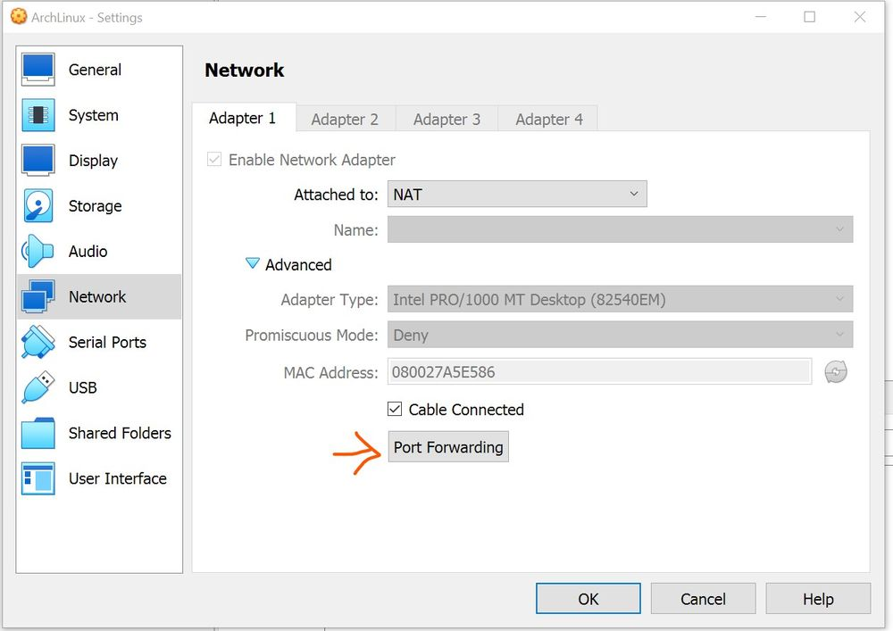
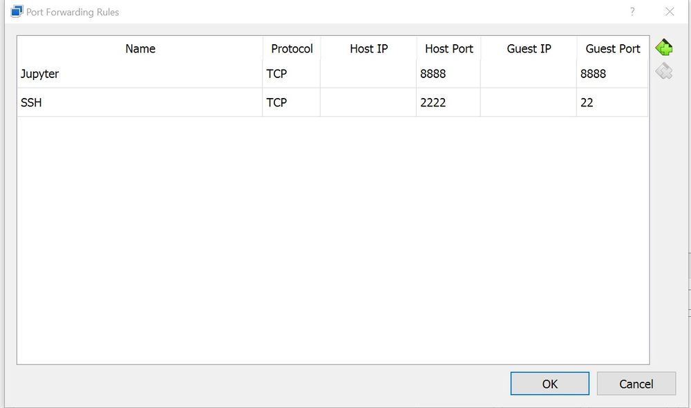

# Arch Linux install and setup notes

## Verifying signature of download on Windows
- Download the simple (non-GUI) Windows installer from here and install if not already done and install.  https://gnupg.org/download/index.html

 - 3 Items are required:
    - the iso file (obtained via magnet link or torrent)
    - the iso signature file (link from Arch download page
    - the public key of the use that signed the iso. This can however be auto-retrieved using gpg command below. 

 - Open cmd and run below command (as per Arch Wiki install instructions Apr 2023)  
  gpg --keyserver-options auto-key-retrieve --verify archlinux-version-<blah>.iso.sig  
  Note that it is the signature file name included as parameter above, not the iso file name.  Iso needs to have same name though without .sig extension

 

## Networking

 

## Arch setup as Virtualbox guest

### SSH
 - Port forwarding needs to be enabled in Virtualbox GUI in order to SSH into virtualbox
 - See relevant sections of below links
 - https://dev.to/developertharun/easy-way-to-ssh-into-virtualbox-machine-any-os-just-x-steps-5d9i
 - https://averagelinuxuser.com/ssh-into-virtualbox/

### Jupyter
 - Port forwarding needs to be enabled Host port  = 8888, Guest Port = 8888

### Virtualbox networking summary

